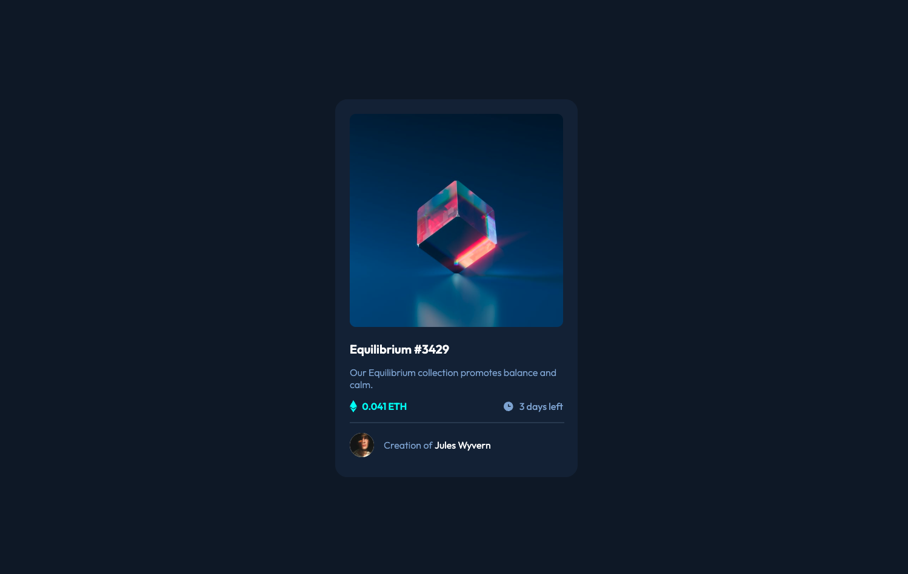
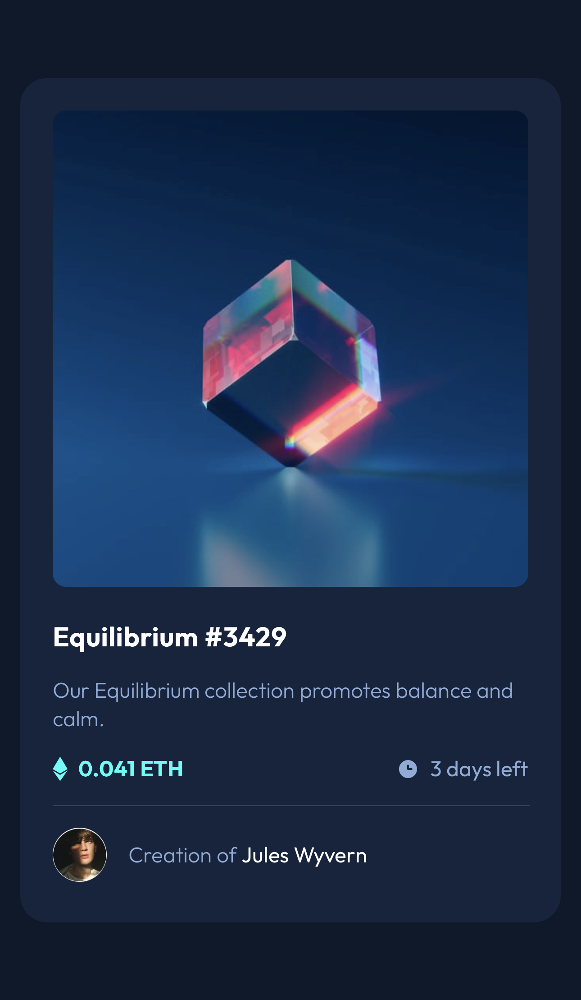

# Frontend Mentor - NFT preview card component solution

This is a solution to the [NFT preview card component challenge on Frontend Mentor](https://www.frontendmentor.io/challenges/nft-preview-card-component-SbdUL_w0U). Frontend Mentor challenges help you improve your coding skills by building realistic projects. 

## Table of contents

- [Overview](#overview)
  - [The challenge](#the-challenge)
  - [Screenshot](#screenshot)
  - [Links](#links)
- [My process](#my-process)
  - [Built with](#built-with)
- [Author](#author)

## Overview

### The challenge

Users should be able to:

- View the optimal layout depending on their device's screen size

### Screenshot
#### Desktop Screenshot

#### Mobile Screenshot

### Links

- Solution URL: [Github Code](https://github.com/dilaraj/nft-preview-card)
- Live Site URL: [Click to Preview](https://dilaraj.github.io/nft-preview-card/)

## My process

### Built with

- Flexbox
- Vite
- Mobile-first workflow
- [React](https://reactjs.org/) - JS library

## Author

- LinkedIn - [Dilara](www.linkedin.com/in/dilara-ajaj8122024)
- Github - [@dilaraj](https://github.com/dilaraj)